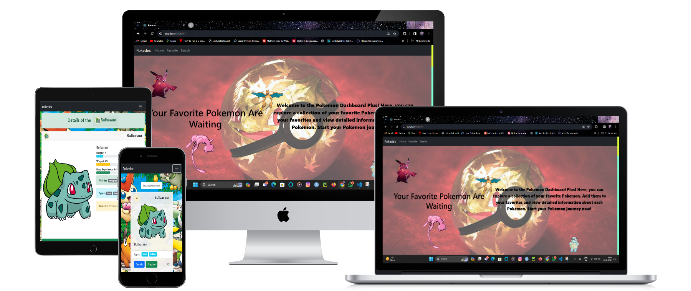
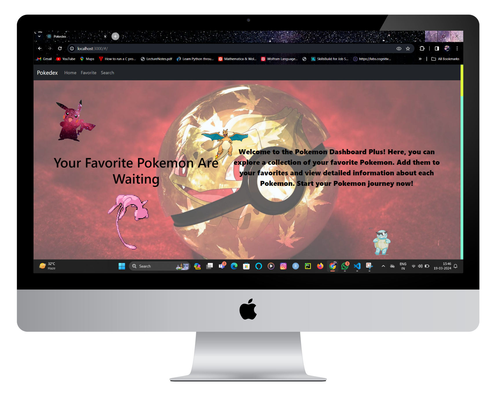

  
  

   
  <h1><b>Pokemon Dashboard Plus</b>  </h1>
 

  <h1>App Mock</h1>
  
  

 
 
 
<!-- TABLE OF CONTENTS -->

# 📗 Table of Contents

- [📖 About the Project](#about-project)
  - [🧪 Linters And test](#linters)
  - [🛠 Built With](#built-with)
    - [Tech Stack](#tech-stack)
    - [Key Features](#key-features)
  - [🚀 Live Demo](#live-demo)
- [💻 Getting Started](#getting-started)
  - [Setup](#setup)
  - [Prerequisites](#prerequisites)
  - [Install](#install)
  - [Usage](#usage)
  - [Run tests](#run-tests)
  - [Deployment](#triangular_flag_on_post-deployment)
- [👥 Authors](#authors)
- [🔭 Future Features](#future-features)
- [🤝 Contributing](#contributing)
- [⭐️ Show your support](#support)
- [🙏 Acknowledgements](#acknowledgements)
- [🧑‍💻 Credits ](#credit)
- [📝 License](#license)

<!-- PROJECT DESCRIPTION -->

# 📖 Pokemon Dashboard Plus 
**Pokemon Dashboard Plus** Welcome to the Pokemon Dashboard Plus! 
                    Here, you can explore a collection of your favorite Pokemon. 
                    Add them to your favorites and view detailed information about each Pokemon. 
                    Start your Pokemon journey now!

 

<!-- ## 🧪 Linters And test 
 -->

## 🛠 Built With 

### Tech Stack 

> In this project I used many skills, tech and libraries

  
Documentation

  <ul>
    <li><a href="https://html.com">HTML</a></li>
  </ul>

  
Styling

  <ul>
    <li><a href="https://www.w3.org">CSS</a></li>
    <li><a href="https://www.bootstrap.org">Bootstrap</a></li>
  </ul>

Dynamics And Logics

  <ul>
    <li><a href="https://www.reactjs.org">React</a></li>
  </ul>

API involved

  <ul>
    <li>Pokedex</li>
  </ul>

 

<!-- Features -->

### Key Features 

> Following features you should observe

- **you can see the pokemon on home page*
- **You can  paginate through various page**
- **you can see short and full details of the pokemon**
- **you can have modal of the each pokemon**

(<a href="#readme-top">back to top</a>)

<!-- LIVE DEMO -->

## 🚀 Live Demo 

> This link will guide you to my project

 
## Presentation video 

(<a href="#readme-top">back to top</a>)

<!-- GETTING STARTED -->

## 💻 Getting Started 

>For having local file and project you can fork this repo 

>And for making changes you you should follow prerequisites

### Prerequisites
To edit this project you need:
 - Node.js installed
 - A Terminal 
 - A web browser
 - An IDE

 - suggested IDE
   - visual studio code
   - atom 
   - visual code 

### Setup

Clone this repository to your desired folder:

 - And run `npm i` in root dir <small>to install node modules</small>
 - Then run `npm run dev` or `npm start`
 - All this makes our project open  in the browser

### Usage

 Execute the following thing:
 
- See Pokemon
- search Pokemon

<!-- ### Run tests

- To run all test cases you need to run `npm test` in the root dir 
- Linters for files run in the root dir
  - `npx eslint "**/*.{js,jsx}` for JS or JSX linting
  - `npx stylelint "**/*.{css,scss}"`for CSS or SCSS linting
  - `npx hint .` for HTML linting
  - `--fix` flag for instant fixable fix -->
 

### Deployment

You can deploy this project using:
- Fork our Repo and clone it or download `zip` and extract it
- Edit some changes
- Run `npm run build` to make our project production ready
- deploy it using [GitHub](www.github.com) pages 
- or use Netlify or Render
 

(<a href="#readme-top">back to top</a>)

<!-- AUTHORS -->

## 👥 Authors 

👤 **Adarsh Pathak**

- GitHub: [@PowerLevel9000](https://github.com/githubhandle)
- Twitter: [@PowerLevel9002](https://twitter.com/PowerLevel9002?t=AIuSN7mTxk5a_MWpLolEjA&s=09)
- LinkedIn: [@Adarsh Pathak](https://www.linkedin.com/in/adarsh-pathak-56a831256/)

<!-- FUTURE FEATURES -->

## 🔭 Future Features 

> Describe 1 - 3 features that will add to the project.

- [ ] **Search Feature**
- [ ] **Pagination**
- [ ] **Stats chart**

(<a href="#readme-top">back to top</a>)

<!-- CONTRIBUTING -->

## 🤝 Contributing 

Contributions, issues, and feature requests are welcome!

Feel free to check the [issues page](https://github.com/PowerLevel9000/pokemon-dashboard-plus/issues).

(<a href="#readme-top">back to top</a>)

<!-- SUPPORT -->

## ⭐️ Show your support 

If you like my Project give it a Star ✨🌟
or
 

(<a href="#readme-top">back to top</a>)

<!-- LICENSE -->

## 📝 License 

This project is [GNU GENERAL PUBLIC LICENSE](https://github.com/PowerLevel9000/pokemon-dashboard-plus/blob/dev/LICENSE) licensed.

(<a href="#readme-top">back to top</a>) 

